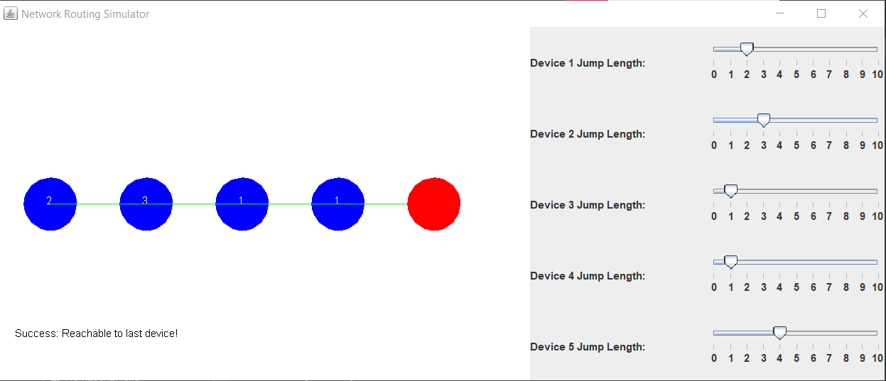

# Network Routing Simulator

This project simulates a network of devices where data is transmitted from the first device to the last device. The network is represented by an array of devices, each with a specified "jump length" indicating how far data can travel from that device. The goal is to visualize how data can traverse the network and determine whether it can reach the last device.

## Features

- **Network Visualization**: Displays the network of devices and their respective jump lengths in a graphical interface.
- **Dynamic Network Configuration**: Allows users to adjust the jump lengths of devices in real-time using sliders.
- **Transmission Validation**: Determines whether data can reach the last device in the network based on the given jump lengths.
- **User Input**: The user is prompted to input the initial configuration of the network through a dialog box.

## Prerequisites

- **Java 8** or higher is required to run the project.

## Installation

### 1. Clone the Repository

```bash
git clone https://github.com/KamalAle12/NetworkSimulatorGUI
cd NetworkSimulatorGUI

## Sample Output

Here is a screenshot of output



